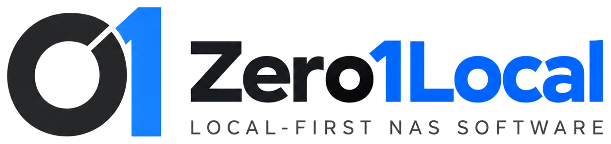

<p align="center">
  
</p>

# Zero1Local

**Local-first NAS software for supported Zero1 NAS hardware.**

Zero1Local replaces the original appliance management experience with an owner-controlled NAS interface while preserving the supported Debian 11 / ARM64 platform and established storage model. Core NAS management is designed to remain usable locally without requiring a vendor cloud account.

> **v1.2.6.2 is a pre-release.** It is intended for qualification on the project test appliance before wider deployment.

## Public repository scope

The public `gigabytegrove/zero1local` repository contains **documentation, branding, support/security information, and production release packages**.

**Zero1Local implementation source code is maintained privately/off-GitHub and is not published as a public source archive.**

For installation or updates, use the production release package attached to the applicable GitHub Release:

```text
Zero1Local-v<version>-production.zip
```

## What v1.2.6.2 focuses on

- A reorganized owner-facing UI with fewer stacked cards, fewer redundant cross-links, and implementation checks moved behind **Advanced** surfaces.
- **Phone Transfer** as a dedicated Sync & Backup workflow for automatic rules and manual phone-to-NAS transfers.
- **Zero1Connect** as its own first-class application area using native shared-folder permissions, root master administration, and automatic managed WireGuard provisioning.
- WireGuard/Zero1Connect capability advertising is now gated by a live create/configure/activate/verify backend probe; unsupported kernels report remote access unavailable instead of claiming support.
- Storage maintenance fixes, including RAID consistency-check control and integrated drive replacement.
- Expanded Storage Analytics with file-type counts/storage visualization, capacity trend, share usage, largest files, and duplicate candidates.
- Consistent terminology including **Docker Compose**, **VLANs**, and **Advanced Stats**.
- System organization that separates **Access & API** from Security and keeps Office under System.
- Optional recovery verification and suppressible repeated advisory notices.
- Theme-correct Zero1Local branding using the supplied transparent light/dark logo assets.

## Main product areas

| Area | Purpose |
| --- | --- |
| Home | Appliance status, current actions, tasks, and notifications |
| Files & Sharing | File Manager, shared folders, users, groups, and secure links |
| Storage | Drives, RAID / Drive Protection, USB storage, and Analytics |
| Sync & Backup | Synchronization, Phone Transfer, restore, backups, and snapshots |
| Zero1Connect | Pairing, native shared-folder access, root master administration, and managed private remote connectivity |
| Apps | App catalog, containers, and Docker Compose |
| Connectivity | Network, VLANs, advanced networking, remote access, and desktop integration |
| System | Updates, power, Access & API, Office, Security, Administrators, Automation, Hardware, Services, Advanced Stats, Logs, and Recovery |

## Zero1Connect

Zero1Connect is developed as a separate Android client. Zero1Local provides `/api/connect/v1`, pairing, authentication, file/transfer services, native shared-folder authorization, and managed WireGuard provisioning. There is no second Zero1Connect file-permission system: a paired phone inherits the same effective shared-folder access as its bound Zero1Local user. A phone paired to `root` receives master file authority.

Pairing asks whether the owner wants managed remote access. When enabled, Zero1Local and the phone configure the private split-tunnel path automatically; the owner is not expected to create WireGuard keys, peers, subnets, or routes manually. Remote status is presented as Automatic setup, Ready, Needs attention, or Off by choice rather than an ambiguous Not configured state.

## Phone Transfer

Phone Transfer lives under **Sync & Backup**. It supports automatic device-specific transfer rules and manual transfer from connected phones. Historical internal API names may remain for compatibility, but the product-facing name is **Phone Transfer**.

## Recovery and notifications

Recovery verification is optional. When disabled, it does not lower protection scoring or create verification reminders. A manual verification attempt with no usable source returns:

```text
No recovery source was available to verify.
```

Owner-facing advisory notifications can be dismissed, snoozed, or ignored so repeated recommendations do not continue to occupy Action Center after the owner has made a decision.

## Installation and updates

Official production packages contain the compiled ARM64 runtime and the established Windows bootstrap installer. In-place updates use Zero1Local's staged validation, direct-refresh route validation, independent Update Monitor, and rollback path.

The accepted Windows installer from v1.2.4.27 remains authoritative and byte-for-byte unchanged unless the project owner explicitly changes it.

For the current release package, see [`RELEASE.md`](RELEASE.md).

## Documentation

Start with [`docs/README.md`](docs/README.md).

Repository policy and public release qualification are documented in [`docs/PUBLIC-RELEASE-GATE.md`](docs/PUBLIC-RELEASE-GATE.md).

## Project attribution

Zero1Local originally created by **Brad Trammell**, a **Gigabyte Grove** project.

See [`LICENSE.md`](LICENSE.md) for the complete license terms and required attribution.
