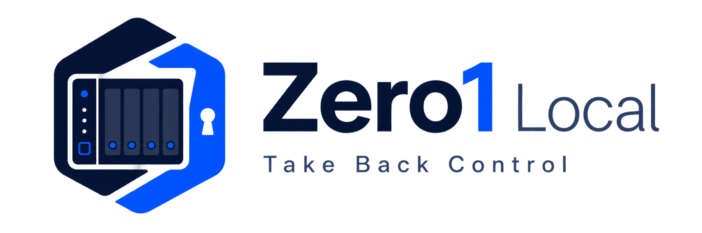

<p align="center">
  
</p>

# Zero1Local

**Take Back Control.** Zero1Local converts the supported IronCow Zero1 NAS into a local-first NAS platform while preserving the appliance's validated Debian 11 / RK3568 hardware foundation.

Current stable release: **v1.2**

Zero1Local is a Gigabyte Grove project originally created by Brad Trammell.

## What Zero1Local does

Zero1Local replaces the cloud-dependent appliance-management experience with a locally managed NAS interface and services. The v1.2 release includes storage and RAID management, SMB/NFS sharing, users and groups, File Manager, Docker/apps, backup/synchronization, networking, notifications, recovery, phone transfer and system administration.

The release is cumulative: you do not install a chain of older Zero1Local versions first.

## Quick install

For a Zero1Local appliance or an already-rooted supported IronCow Zero1:

```powershell
.\Install-Zero1Local.ps1 <NAS-IP>
```

For a supported factory-stock IronCow Zero1 requiring the root bootstrap:

```powershell
.\Install-Zero1Local.ps1 <NAS-IP> -Serial '<NAS_SERIAL>'
```

Read [Installation](docs/INSTALLATION.md) before deploying to a factory-stock appliance.

## Core areas

| Area | v1.2 capability |
| --- | --- |
| Storage | Main Storage identity protection, RAID adoption/management, guarded `/disk0`, disk health and analytics |
| Files | SMB, userspace NFSv3, FTP/Time Machine where supported, File Manager, Recycle Bin, secure links |
| Users | Users, groups, Samba access, account policy and delegated administrators |
| Apps | Existing Docker engine adoption, container management, Compose and App Catalog |
| Protection | Backup, restore, synchronization, replication, cloud/off-site workflows |
| Phone | Manual Android MTP transfer, automatic offload, nicknames, progress/ETA/controls |
| Network | Hostname, DNS, VLANs, advanced network configuration and optional WireGuard |
| Recovery | Independent recovery service, Recovery Key, emergency SSH and rollback-safe installation |

## Documentation

The repository documentation is organized for both owners and contributors:

- [Documentation home](docs/README.md)
- [Getting started](docs/GETTING-STARTED.md)
- [Installation](docs/INSTALLATION.md)
- [Hardware support](docs/HARDWARE-SUPPORT.md)
- [Architecture and services](docs/ARCHITECTURE.md)
- [Storage and RAID](docs/STORAGE-AND-RAID.md)
- [Files, users and shares](docs/FILES-USERS-AND-SHARES.md)
- [SMB and NFS](docs/SMB-AND-NFS.md)
- [File Manager](docs/FILE-MANAGER.md)
- [Phone Transfer](docs/PHONE-TRANSFER.md)
- [Task Center](docs/TASK-CENTER.md)
- [Docker and Apps](docs/DOCKER-AND-APPS.md)
- [Backup, sync and replication](docs/BACKUP-SYNC-AND-REPLICATION.md)
- [Networking](docs/NETWORKING.md)
- [Remote access](docs/REMOTE-ACCESS.md)
- [Office integration](docs/OFFICE.md)
- [Notifications](docs/NOTIFICATIONS.md)
- [Security model](docs/SECURITY-MODEL.md)
- [Recovery](docs/RECOVERY.md)
- [LED status](docs/LED-STATUS.md)
- [Troubleshooting](docs/TROUBLESHOOTING.md)
- [Evidence collection](docs/SUPPORT-EVIDENCE.md)
- [Known limitations](docs/KNOWN-LIMITATIONS.md)
- [FAQ](docs/FAQ.md)
- [Source and build](docs/SOURCE-AND-BUILD.md)

## Important design principles

- **Local first.** Core NAS operation does not require a Zero1Local cloud account.
- **Evidence first.** Zero1Local should fail closed when storage, identity or recovery state cannot be proven.
- **Owner data first.** Existing data is not assumed disposable.
- **Rollback safe.** Installation snapshots state and rolls back when final verification fails.
- **No kernel replacement.** v1.2 preserves the validated vendor kernel/bootloader/DTB.
- **Recovery independent of the main UI.** The Recovery Environment listens separately on TCP/8089.

## Support

Before opening an issue, read [SUPPORT.md](SUPPORT.md) and [Troubleshooting](docs/TROUBLESHOOTING.md). Never publish passwords, recovery keys, OAuth credentials, GitHub tokens or private SSH keys in an issue.

## License

See [LICENSE.md](LICENSE.md). Attribution to Brad Trammell and Gigabyte Grove must be retained as specified by the license.
